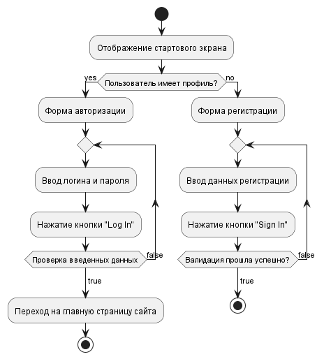
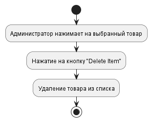
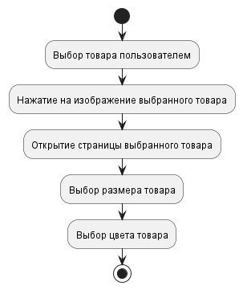
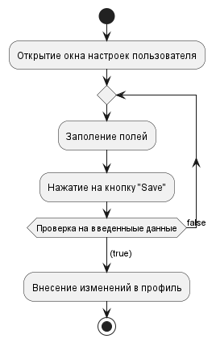

# Содержание
1. [Авторизация в приложении](#1)
2. [Добавление товара](#2)
3. [Удаление товара](#3)
4. [Просмотр товара](#4)
5. [Настройка профиля](#5)

### 1. Авторизация в приложении
При открытии приложения, пользователь видет стартовое окно, где ему предлагают пройти авторизацию, либо регистрацию, если пользователь не имеет аккаунта на сайте. Приложение отображает окно для ввода данных. После ввода данных, они проверяются на корректность. Если данные ведены правильно, то приложение предоставляет доступ к основным функциям.

### 2. Добавление товара
При нажатии на кнопку "Add Item" приложение добавит заполненный шаблон в список товаров.

  
### 3. Удаление товара
При нажатии на кнопку "Delete Item" приложение удалит товар из списка.

### 4. Просмотр товара
При нажатии на изображение товара появится выбранный товар с возможностью выбрать размер и цвет.

### 5. Настройка профиля
После открытия настроек пользователя есть возможность настроить профиль, изменив несколько параметров.

