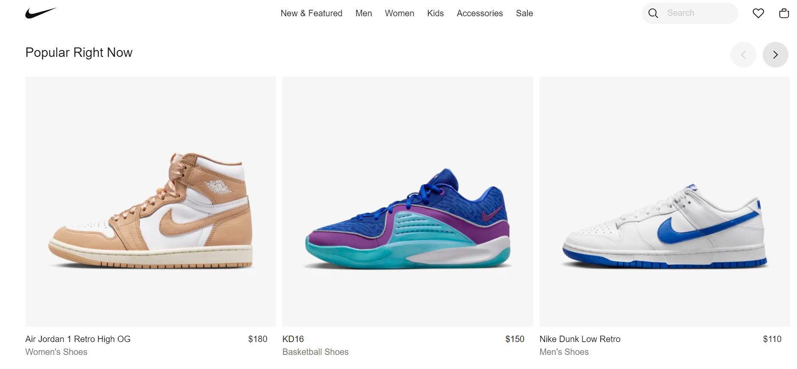
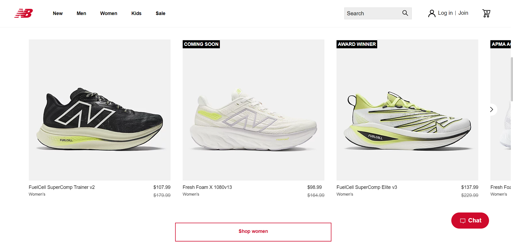
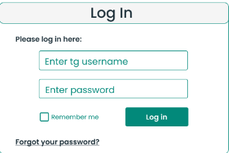
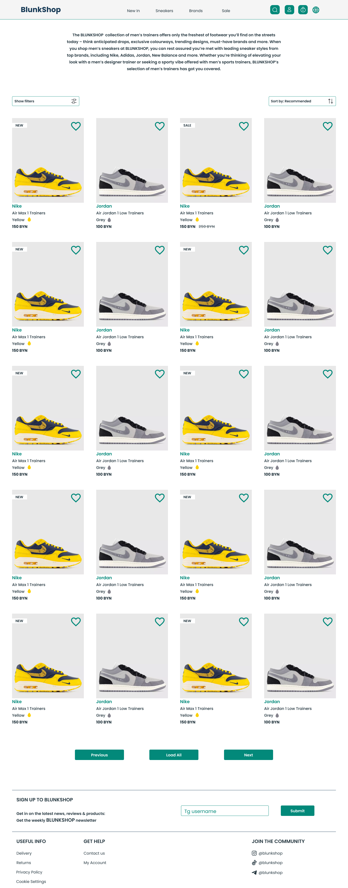
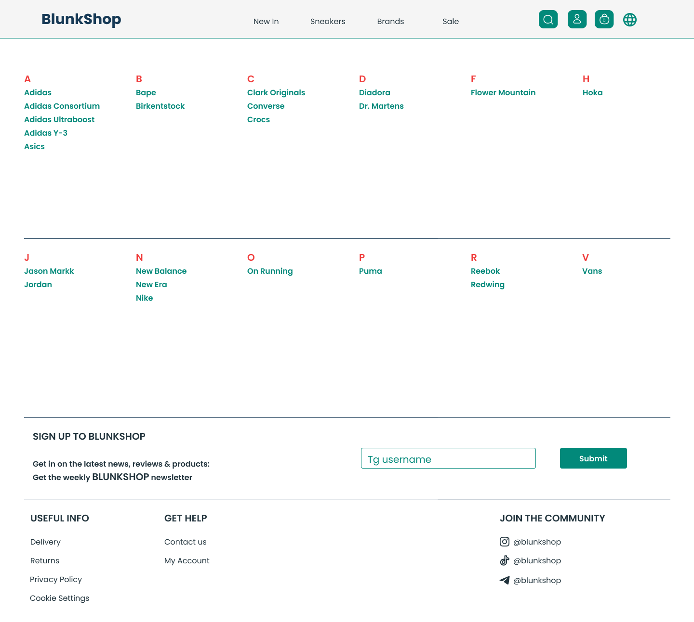

# Требования к проекту
---

# Содержание

1. [Введение](#intro)  
   1.1 [Назначение](#appointment)  
   1.2 [Бизнес-требования](#business_requirements)  
   1.2.1 [Исходные данные](#initial_data)  
   1.2.2 [Возможности бизнеса](#business_opportunities)  
   1.2.3 [Границы проекта](#project_boundary)  
   1.3 [Аналоги](#analogues)  
   1.3.1 [Nike](#nike)  
   1.3.2 [New Balance](#new_balance)  
   1.3.3 [Air-Shop](#air_shop)
2. [Требования пользователя](#user_requirements)  
   2.1 [Программные интерфейсы](#software_interfaces)  
   2.2 [Интерфейс пользователя](#user_interface)  
   2.3 [Характеристики пользователей](#user_specifications)  
   2.3.1 [Классы пользователей](#user_classes)  
   2.3.2 [Аудитория приложения](#application_audience)  
   2.3.2.1 [Целевая аудитория](#target_audience)  
   2.3.2.1 [Побочная аудитория](#collateral_audience)  
   2.4 [Предположения и зависимости](#assumptions_and_dependencies)
3. [Системные требования](#system_requirements)  
   3.1 [Функциональные требования](#functional_requirements)  
   3.1.1 [Основные функции](#main_functions)  
   3.1.1.1 [Вход пользователя в приложение](#user_login_to_the_application)  
   3.1.1.2 [Настройка профиля активного пользователя](#setting_up_the_profile_of_the_active_user)  
   3.1.1.3 [Добавление записей](#add_notation)  
   3.1.1.4 [Выход пользователя из учётной записи](#active_user_change)   
   3.1.2 [Ограничения и исключения](#restrictions_and_exclusions)  
   3.2 [Нефункциональные требования](#non-functional_requirements)  
   3.2.1 [Атрибуты качества](#quality_attributes)  
   3.2.1.1 [Требования к удобству использования](#requirements_for_ease_of_use)  
   3.2.1.2 [Требования к безопасности](#security_requirements)  
   3.2.1.3 [Требования к производительности](#performance_requirements)  
   3.2.2 [Внешние интерфейсы](#external_interfaces)  
   3.2.3 [Ограничения](#restrictions)

# 1 Введение

## 1.1 Назначение

Веб-приложение "BlunkShop" - это онлайн-бутик обуви, где вы можете легко выбрать и заказать вашу идеальную пару обуви.
Веб-приложение создано для пользователей любого браузера.

<a name="business_requirements"/>

## 1.2 Бизнес-требования

<a name="initial_data"/>

### 1.2.1 Исходные данные

Современное поколение часто ощущает дефицит времени, и поход в обычные магазины становится роскошью, которую не всегда
удается позволить себе. Это именно та ситуация, когда виртуальные решения приходят на помощь. В наше время множество
веб-приложений предлагают удобные онлайн-заказы различных товаров, и наш магазин обуви "BlunkShop" не исключение.

<a name="business_opportunities"/>

### 1.2.2 Возможности бизнеса

Это веб-приложение обречено на успех в современном мире, где время человека оценивается как никогда дорого. Оно призвано
сделать жизнь пользователей проще и более удобной, и, безусловно, будет пользоваться заслуженной популярностью.

<a name="project_boundary"/>

### 1.2.3 Границы проекта

Веб-приложение для клиента позволяет выбирать и заказывать пары обуви. А в функционал администратора входит создание,
изменение и удаление товаров, обработка заказов.

<a name="analogues"/>

## 1.3 Аналоги

<a name="nike"/>

### 1.3.1 Nike

**Русский интерфейс:** нет  
**Цена:** бесплатный  
**Ссылка на сайт производителя:** https://www.nike.com

Окно Nike  
  
Nike.com — официальный интернет-магазин компании Nike, одного из самых известных и крупных производителей спортивной
обуви, одежды и аксессуаров в мире. В этом магазине представлена широкая линейка продукции бренда Nike, включая
спортивную обувь, одежду и спортивные аксессуары для различных видов спорта и активного образа жизни. Ключевые
характеристики и особенности магазина Nike.com включают широкий ассортимент продукции, пользовательский заказ, мировую
доставку, программу лояльности.

<a name="new_balance"/>

## 1.3.2 New Balance

**Русский интерфейс:** нет  
**Цена:** бесплатный  
**Ссылка на сайт производителя:** http://www.newbalance.com

Окно New Balance.  

New Balance - это американская компания, специализирующаяся на производстве спортивной обуви и одежды. Она известна
своими высококачественными продуктами и долгой историей на рынке спортивной индустрии. New Balance часто выделяется
своим акцентом на комфорте и инновациях в обуви. Они могут иметь свои технологии и подходы к созданию спортивной обуви,
которые отличаются от Nike, а также сайт NewBalance предоставляет широкий ряд выбора языков.

<a name="air_shop"/>

## 1.3.3 Air-Shop

**Русский интерфейс:** есть  
**Цена:** бесплатный
**Ссылка на сайт производителя:** http://www.air-shop.by

Окно Air-Shop.  

Air-Shop - это сайт белорусского магазина обуви. В отличие от Nike и New Balance не является производителем, а просто
реализует поставляемый ему товар, также доставка распространяется только на территорию Республики Беларусь и имеет цены
значительно выше, чем у других интернет-магазинов.

<a name="comparison_of_applications"/>

# 2 Сравнение веб-приложений

| Функция                       | Nike | New Balance | Air-Shop |
|:------------------------------|:----:|:-----------:|:--------:|
| Поддержка русского языка      |  -   |      -      |    +     |
| Бесплатное использование      |  +   |      +      |    +     |
| Широкий ассортимент           |  -   |      -      |    +     |
| Доставка                      |  +   |      +      |    +     |
| Приемлемые цены               |  +   |      -      |    -     |
| Поддержка мобильных устройств |  +   |      +      |    +     |

<a name="user_requirements"/>

# 2 Требования пользователя

<a name="software_interfaces"/>

## 2.1 Программные интерфейсы

Составляющие проекта:
Хранение данных будет реализовано в SQL таблицах, где будет информация о пользователях и товарах. Серверная часть будет
реализовывать главную логику приложения, работать с базой данных через SQL запросы. Язык написания: Java и фреймворк
Spring. Клиентская часть будет реализовывать функционал backend приложения посредством вызова API методов. Язык
написания: JavaScript фреймворк - React.

<a name="user_interface"/>

## 2.2 Интерфейс пользователя

Окно регистрации нового пользователя.  
При нажатии на кнопку "Sign Up" - переход к только что созданному профилю, если введены все поля.   
  
Окно входа уже зарегистрированного пользователя.  
При нажатии на кнопку "Log In" - переход на страницу своего профиля, если введены все поля.  
При нажатии на кнопку "Remember me" - осуществляется запоминание данных пользователя для последующих входов. При нажатии
на кнопку "Forgot your password?" - осуществляется переход на страницу восстановления пароля.
   
Главное окно веб-приложения.  
При нажатии на кнопку "New In" - веб-приложение переходит в окно ассортимента обуви с аттрибутом поиска "new".  
При нажатии на кнопку "Sneakers" - веб-приложение переходит в окно ассортимента обуви.  
При нажатии на кнопку "Brands" - веб-приложение переходит в окно со всеми брендами обуви.  
При нажатии на кнопку "Sale" - веб-приложение переходит в окно ассортимента обуви с аттрибутом поиска "sale".  
При нажатии на кнопку "Search" - в веб-приложении появляется новый элемент окна с возможностью ввода названия обуви для
поиска.  
При нажатии на кнопку "Profile" - веб-приложение переходит в окно с профилем, если пользователь уже авторизован, или в
окно со входом и регистрации, если пользователь еще не авторизован или у него нет учетной записи.  
При нажатии на кнопку "Basket" - веб-приложение переходит в окно с корзиной.  
При нажатии на кнопку "Language" - в веб-приложении появляется новый элемент окна с возможностью выбора языка интерфейса
веб-приложения: русский или английский.  
  
Окно ассортимента магазина.  
При нажатии на кнопку "Previous" - осуществляется переход на предыдущую страницу ассортимента обуви.  
При нажатии на кнопку "Load All" - осуществляется загрузка всего ассортимента на текущей странице.  
При нажатии на кнопку "Next" - осуществляется переход на следующую страницу ассортимента обуви.
  
Окно выбора брендов.  
Окно имеет много брендов, при нажатии на название любого из них осуществляется переход к моделям обуви выбранного бренда.  

<a name="user_specifications"/>

## 2.3 Характеристики пользователей

<a name="user_classes"/>

### 2.3.1 Классы пользователей

| Класс пользователей             | Описание                                                                                                                                                                                                |
|:--------------------------------|:--------------------------------------------------------------------------------------------------------------------------------------------------------------------------------------------------------|
| Зарегистрированные пользователи | Пользователи, которые вошли в приложение под своей электронной почтой, желающие просматривать модели обуви, делать заказ. Имеют доступ к ограниченному функционалу                                      |
 | Администратор                   | Пользователи, которые вошли в приложение под своей электронной почтой, желающие просматривать модели обуви, делать заказ, добавлять, изменять, удалять модели обуви. Имеют доступ к полному функционалу |

<a name="application_audience"/>

### 2.3.2 Аудитория приложения

<a name="target_audience"/>

#### 2.3.2.1 Целевая аудитория

Люди возрастной категории: молодежь.

<a name="collateral_audience"/>

#### 2.3.2.2 Побочная аудитория

Люди младшей и старшей возрастных категорий.

<a name="assumptions_and_dependencies"/>

## 2.4 Предположения и зависимости

Веб-приложение работает некорректно при большом количестве запросов к нему за определенный промежуток времени.

<a name="system_requirements"/>

# 3 Системные требования

<a name="functional_requirements"/>

## 3.1 Функциональные требования

<a name="main_functions"/>

### 3.1.1 Основные функции

<a name="user_login_to_the_application"/>

#### 3.1.1.1 Вход пользователя в приложение

**Описание.** Пользователь имеет возможность использовать ограниченный набор инструкций веб-приложения без вхождения в
свою учётную запись. Например: просмотр ассортимента товаров.

| Функция | Требования                                                                                                                                                                                                                           | 
|:---|:-------------------------------------------------------------------------------------------------------------------------------------------------------------------------------------------------------------------------------------|
| Регистрация нового пользователя | Приложение должно запросить у пользователя ввести электронную почту и пароль для создания учётной записи. Пользователь должен ввести электронную почту и пароль.                                                                     |
| Вход зарегистрированного пользователя в приложение | Приложение запрашивает у пользователя ввести электронную почту и пароль, проверка правильности данных происходит на серверной части приложения, после успешной аутентификации пользователь перенаправляется на страницу его профиля. |

<a name="setting_up_the_profile_of_the_active_user"/>

#### 3.1.1.2 Настройка профиля активного пользователя

**Описание.** Зарегистрированный пользователь имеет возможность редактировать своё имя и пароль.

| Функция | Требования | 
|:---|:---|
| Изменение имени пользователя | Приложение должно запросить ввести новое имя а также пароль для подтверждения действия. Если выбранное имя уже существует, приложение предоставит возможность повторного ввода |
| Изменение пароля | Зарегистрированный пользователь имеет возможножность изменить пароль, при этом приложение запрашивает ввести старый пароль для подтверждения личности |

<a name="add_notation"/>

#### 3.1.1.3 Действия над товарами

**Описание.** После авторизации пользователя и проверки его роли админстратора. Администратором возможно добавление
товаров, их редактирование и удаление.

| Функция               | Требования                                                                                                                                                        | 
|:----------------------|:------------------------------------------------------------------------------------------------------------------------------------------------------------------|
| Добавление товара     | Веб-приложение создает товар, предоставив администратору бланк заполнения товара, в котором указана бренд, марка, размер, цвет, артикул, цена и фотографии товара |
| Редактирование товара | Веб-приложение предоставляет доступ к уже созданному товару, для его изменения                                                                                    |
| Удаление товара       | Веб-приложение удаляет созданный товар по введённой артиклу                                                                                                       |
| Поиск товара          | Веб-приложение предоставляет поиск товаров по их марке                                                                                                            |

<a name="active_user_change"/>

#### 3.1.1.4 Выход зарегистрированного пользователя из учётной записи

**Описание.** Зарегистрированный пользователь имеет возможность выйти из учётной записи.

**Требование.** Веб-приложение должно предоставить зарегистрированному пользователю возможность выйти из учётной записи
с возвратом к главному окну в веб-приложении.

<a name="restrictions_and_exclusions"/>

### 3.1.2 Ограничения и исключения

1. Веб-приложение работает корректно только при хорошем Интернет-соединении;
2. Отсутствует возможность заказывать товар, не имея учётной записи.

<a name="non-functional_requirements"/>

## 3.2 Нефункциональные требования

<a name="quality_attributes"/>

### 3.2.1 Атрибуты качества

<a name="requirements_for_ease_of_use"/>

#### 3.2.1.1 Требования к удобству использования

1. Доступ к основным функциям веб-приложения не более чем за одну операцию;
2. Все функциональные элементы пользовательского интерфейса имеют названия, описывающие действие, которое произойдет при
   выборе элемента;
3. Пошаговая инструкция использования основных функций приложения отображена в справке.

<a name="security_requirements"/>

#### 3.2.1.2 Требования к безопасности

Веб-приложение предоставляет возможность просмотра и редактирования профиля только авторизированному пользователю.

<a name="external_interfaces"/>

### 3.2.2 Внешние интерфейсы

Окна веб-приложения удобны для использования пользователями с плохим зрением:

* размер шрифта не менее 14пт;
* функциональные элементы контрастны фону окна.

<a name="restrictions"/>

### 3.2.3 Ограничения

1. Приложение реализовано на платформе Spring Framework;
2. Все записи хранятся в базе данных PostgreSQL.

