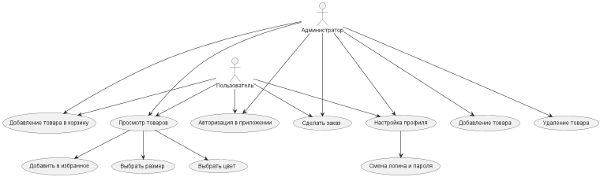

# Поток событий
---

# Содержание
1 [Актёры](#1)  
2 [Варианты использования](#2)  
2.1 [Авторизация в приложении](#2.1)  
2.2 [Добавление заметки](#2.2)  
2.3 [Удаление заметки](#2.3)  
2.4 [Просмотр заметки](#2.4)  
2.5 [Настройка профиля](#2.5)  
2.6 [Загрузка фотографии](#2.6)  
2.7 [Выбор даты](#2.7)  
2.8 [Выбор оповещений](#2.8)  
2.9 [Установка важной заметки](#2.9)  
2.10 [Смена имени и пароля](#2.10)  
<a name="1"/>

# 1 Актёры

| Актёр | Описание |
|:--|:--|
| Пользователь приложения | Человек, имеющий(желающий создать) аккаунт в приложении "Organizer" |

<a name="2"/>

# 2 Варианты использования

<a name="2.1"/>

## 2.1 Авторизация в приложении

**Описание.** Вариант использования "Авторизация в приложении" позволяет пользователю войти(создать) в свой аккаунт приложения "Organizer".  

**Основной поток.**
1. Вариант использования начинается, когда пользователь запускает приложение;
2. Приложение выводит экран, на котором расположена кнопка "Войти";
3. Пользователь нажимает кнопку "Войти";
4. Приложение предлагает пользователю ввести логин и пароль;
5. Пользователь вводит логин и пароль;
6. Приложение проверяет правильность введенных данных. Если данные введены неправильно, приложение просит ввести данные повторно;
7. Приложение открывает главное окно для оставления заметок;
8. Вариант использования завершается;

<a name="2.2"/>

## 2.2 Добавление заметки

**Описание.** Вариант использования "Добавление заметки" позволяет пользователю добавить заметку в список.  

**Основной поток.**
1. Пользователь заполняет шаблон заметки. Если 1 и более поле не заполнено, заметка не добавится;
2. Приложение показывает получившуюся заметку и просит одобрение на размещение. Если одобрение не получено, приложение возвращается к заполнению шаблона;
3. Приложение добавляет заметку в список;
4. Вариант использования завершается;

<a name="2.3"/>

## 2.3 Удаление заметки

**Описание.** Вариант использования "Удаление заметки" позволяет пользователю удалить выбранную заметку.

**Основной поток.**
1. Пользователь выбирает заметку;
2. Пользователь нажимает кнопку "Удалить заметку";
3. Приложение удаляет заметку из списка;
4. Вариант использования завершается;

<a name="2.4"/>

## 2.4 Просмотр заметки

**Описание.** Вариант использования "Просмотр заметки" позволяет просмотреть выбранную заметку и отредактировать.  

**Основной поток.**
1. Пользователь выбирает заметку;
2. Пользователь нажимает кнопку "Просмотр";
3. Приложение показывает все поля заметки с возможностью редактирования;
4. Пользователь сохраняет заметку;
5. Вариант использования завершается;

<a name="2.5"/>

## 2.5 Настройка профиля

**Описание.** Вариант использования "Настройка профиля" позволяет отредактировать профиль пользователя.  
**Предусловие.** Пользователь выбрал раздел "Настройка" в главном окне.

**Основной поток.**
1. Пользователь заполняет все интересующие поля. Если не все поля заполнены, изменения не сохранятся;
2. Пользователь нажимает кнопку "Сохранить";
3. Приложение вносит изменения;
4. Вариант использования завершается;

<a name="2.6"/>

## 2.6 Загрузка фотографии

**Описание.** Вариант использования "Загрузка фотографии" позволяет изменить аватар пользователя.

**Основной поток.**
1. Пользователь нажимает кнопку "Загрузить фото";
2. Приложение открывает окно для загрузки файла;
3. Пользователь выбирает файл;
4. Приложение изменяет фото пользователя;
5. Вариант использования завершается;

<a name="2.7"/>

## 2.7 Выбор даты

**Описание.** Вариант использования "Выбор даты" позволяет пользователю установить свою дату рождения.

**Основной поток.**
1. Пользователь нажимает на ComboBox "Дата рождения";
2. Пользователь устанавливает дату;
3. Приложение изменяет дату;
4. Вариант использования завершается.

<a name="2.8"/>

## 2.8 Выбор оповещений

**Описание.** Вариант использования "Выбор оповещений" позволяет установить оповещение на определённую заметку.

**Основной поток.**
1. Пользователь нажимает на ComboBox "Оповещения";
2. Пользователь устанавливает оповещение;
3. Вариант использования завершается;

<a name="2.9"/>

## 2.9 Установка важной заметки

**Описание.** Вариант использования "Установка важной заметки" позволяет добавить свойство для выбранной заметки.

**Основной поток.**
1. Пользователь выбирает заметку;
2. Пользователь нажимает на кнопку "Важная заметка";
3. Приложение добавляет для выбранной заметки свойство;
4. Вариант использования завершается;

<a name="2.10"/>

## 2.10 Смена имени и пароля

**Описание.** Вариант использования "Смена имени и пароля" позволяет изменить имя и пароль от аккаунта.

**Предусловие.** Пользователь должен выполнить вход в свой аккаунт.

**Основной поток.**
1. Пользователь заполняет поля имени и пароля;
2. Пользователь нажимает кнопку "Сохранить";
3. Приложение вносит изменения;
4. Вариант использования завершается;